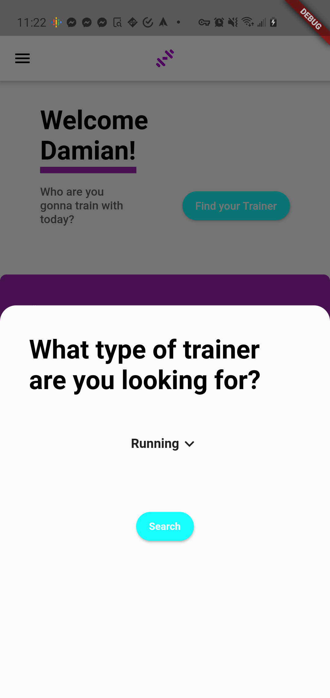

<!-- <div align="center">

</div>
<div style="text-align: center;">skillTrain</div> -->

<h1 style="font-weight:normal">
  <a href="https://play.google.com/store/apps/details?id=com.skillTrain.skillTrain">
   
  </a>
  skillTrain
  
</h1>
🏋️‍♂️ A remote training platform for gym junkies and gym trainers.
<br>
<br>

  

# Features

- 🛒 Marketplace for online trainers to keep working from anywhere!
- 💬 Users and trainers can communicate through text chat
- 📹 Sessions are conducted through video chat
- 🤳 Users can livestream their sessions
- 📝 Trainers can register and edit sessions

# Get started

The easiest way to get started is to download our app from the Google Play app store right now! 👇

 <a href="https://play.google.com/store/apps/details?id=com.skillTrain.skillTrain">
   Google Play Link
  </a>

# Gallery

<center>
  <table>
    <tr>
      <td><a href="https://play.google.com/store/apps/details?id=com.skillTrain.skillTrain"></a></td>
      <td><a href="https://play.google.com/store/apps/details?id=com.skillTrain.skillTrain"></a></td>
      <td><a href="https://play.google.com/store/apps/details?id=com.skillTrain.skillTrain"></a></td>
      <td><a href="https://play.google.com/store/apps/details?id=com.skillTrain.skillTrain"></a></td>
     </tr>

  </table>
</center>

# Tech Used

## Frontend

- <a href="https://flutter.dev/">Flutter</a>
- <a href="https://dart.dev/">Dart</a>
- <a href="https://www.agora.io/en/">Agora</a>

## BackEnd

- <a href="https://aws.amazon.com/">Amazon Web Services</a>
  - AWS Amplify
  - DynamoDb
  - S3
  - API Gateway
  - AWS Lambda
  - Cognito
- <a href="https://stripe.com/">Stripe</a>

# Coming Soon

- iOS Deployment

<br>
<br>

# 日本語版 README


スキルトレインとは、トレーニングインストラクターと生徒とをマッチングさせ、オンラインレッスンを行うための android スマートフォンアプリです。

```
1. 必要条件
2. システム概要
3. インストール方法
4. 使い方
5. 各機能について
5-1.  🛒 オンライン上でのレッスン予約・支払い
5-2.  💬 インストラクター・生徒間でのテキストチャット機能
5-3.  📹 ビデオチャット機能
5-4.  🤳 授業風景のライブストリーム機能
5-5.  📝 授業の管理機能
6. ライセンス情報
```

## 1. システム概要

## フロントエンド

- <a href="https://flutter.dev/">Flutter</a>
- <a href="https://dart.dev/">Dart</a>
- <a href="https://www.agora.io/en/">Agora</a>

## バックエンド

- <a href="https://aws.amazon.com/">Amazon Web Services</a>
  - AWS Amplify
  - DynamoDb
  - S3
  - API Gateway
  - AWS Lambda
  - Cognito
- <a href="https://stripe.com/">Stripe</a>

## 2. 必要条件

```
flutter
  amazon_cognito_identity_dart_2: ^0.1.24
  amplify_storage_s3: "<1.0.0"
  amplify_core: "<1.0.0"
  amplify_auth_cognito: "<1.0.0"
  amplify_analytics_pinpoint: "<1.0.0"
  intl: ^0.16.1
  date_calc: ^0.1.0
  file_picker: "^1.8.0+1"
  stripe_payment: ^1.0.6
  http: ^0.12.1
  agora_rtc_engine: ^3.1.3
  permission_handler: ^5.0.1
  flutter_dotenv: ^2.0.1
  modal_progress_hud: ^0.1.3
  shared_preferences: ^0.5.12+4
  url_launcher: ^3.0.3
  material_design_icons_flutter: 4.0.5855
  spannable_grid: ^0.1.0
  flutter_launcher_icons: "^0.8.0"
  flutter_rating_bar: ^3.2.0+1
  web_socket_channel: ^1.2.0
  share: ^0.5.3
  transparent_image: ^1.0.0
```

## 3.インストール方法

■androidスマートフォン  
Android ストアより以下のアプリケーションをダウンロードし、インスールしてください。  
https://play.google.com/store/apps/details?id=com.skillTrain.skillTrain

■flutter
エミューレータ上での実行方法は以下の通り
1. プロジェクトファイルをダウンロードする。
2. ターミナル上で$ flutter get pub　を入力して各種ライブラリーをインストールする。
3. $ flutter emulator --launch "任意のエミュレータ名"を実行
4. $ flutter run

## 4.使い方

### 生徒側ページ  


```
生徒側ページでは以下の操作を行うことができます。  
・講義ジャンルからの講師検索  
・各種レッスン情報の一覧確認  
・レッスン予約登録  
・予約済みレッスンの一覧確認  
・テキストチャット（レッスン前）  
・ビデオチャット（レッスン中）  
```
### 講師側ページ  
```
講師側ページでは以下の操作を行うことができます。
・講義登録  
・登録済み講義一覧  
・講義情報変更／キャンセル登録  
・講師情報登録  
・受講予約済み講義一覧  
```

## 5.各機能について

### 5-1. オンライン上でのレッスン予約・支払い

サインアップ時にトレイナーとして登録するかトレイニーとして登録するかを選択します。
登録に必要な情報を登録後、トレイナーはトレイナー専用ページに、トレイニーはトレイニー専用ページに遷移します。
ユーザー認証は AWS の認証システムにより行われます。flutter 上での実装にあたっては以下のライブラリを使用しています。  
```
 amazon_cognito_identity_dart_2: ^0.1.24  
 amplify_core: "<1.0.0"  
 amplify_auth_cognito: "<1.0.0"
```

### ＜トレイナー＞
トレイナー専用ページへの遷移後、以下の操作を行います。
①支払い情報登録  
　**注意**
　**支払い情報登録を完了していない場合、講師は新たに講義登録を行うことができません。**

②レッスン登録  
　登録されたレッスンの一覧は、トップページ左上のメニュー内部「Session update」から確認することができます。  
③レッスン情報変更
　生徒が受講を希望していない場合に限り、トレイナーは登録済みの授業内容の変更またはキャンセルを行うことができます。  
  
### ＜生徒＞
生徒専用ページへの遷移後、以下の操作を行います。  
①受けたいレッスンのジャンルを選択して講師候補を表示選択する。  
②受講したい日時のレッスンを選択し支払いを済ませる。

受講料の支払いは Stripe を介して行われます。
支払い完了後にレッスン予約の情報が反映されます。

支払い処理には以下の flutter ライブラリを使用しています。
```
stripe_payment: ^1.0.6
```
③予約済みのレッスン一覧はトップ画面から確認することができます。

### 5-2. トレイナーページ / トレイニーページ

トレイナーとトレイニーの各ページの機能は以下の通り

＜トレイナー＞
支払い情報登録  
 講義登録  
 講義情報変更  
 講師情報更新


＜トレイニー＞

### 5-3. ビデオチャット
  
トレイナーとトレイニーはビデオチャットを介してオンラインレッスンを行うことができます。  
  
  

ビデオチャットには以下の flutter ライブラリを使用しています。

```
agora_rtc_engine: ^3.1.3
```

### 5-4. テキストチャット
  
トレイナーとトレイニーはテキストチャットを介してレッスン開始前に連絡を行うことができます。  
  
テキストチャットには以下の flutter ライブラリを使用しています。  
  
```
agora_rtc_engine: ^3.1.3
permission_handler: ^5.0.1
```

### 5-5. 支払い


## 6.ライセンス

android スマートフォン
